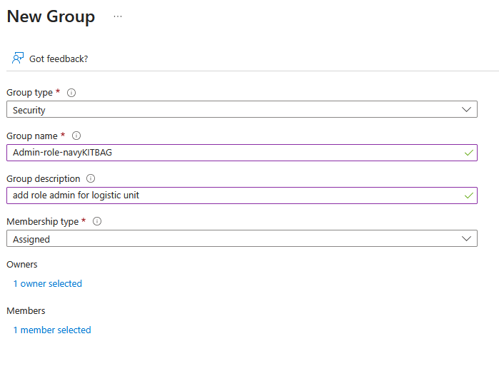
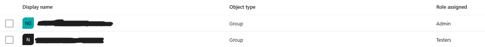

# How to Add a Group with a Role to the Access Token (Azure Portal)

This guide explains how to add an **Azure AD Group** with an **App Role**, so that the role
will appear inside the **access token** issued by Azure.

---

## Step 1: Create an App Role in the Application

1. Open Azure Portal: [Microsoft Azure](https://portal.azure.com)
2. Navigate to:  
   **App registrations → All applications → select your application**
3. Go to:  
   **Manage → App roles**
4. Click **Create app role**
5. Fill in the details and click **Apply**

After that, you should see something like this:

---

## Step 2: Create or Select an Azure AD Group

1. Open Azure Portal: [Microsoft Azure](https://portal.azure.com)
2. Navigate to:  
   **Groups → New group**
3. Fill in the group details (name, description, membership type)
4. Click **Create**

⚠️ **Important:**  
Don’t forget to add users as **members** of the group.

Example:

---

## Step 3: Assign the Group to the App Role

1. Open Azure Portal: [Microsoft Azure](https://portal.azure.com)
2. Navigate to:  
   **Enterprise applications → All applications**
3. Select your application
4. Go to **Users and groups**
5. Click **Add user/group**
6. Select:
   - The **group** you created
   - The **app role** you want to assign
7. Click **Assign**

After that, you should see the group listed with its assigned role:

---

## ✅ Result

After completing these steps, every user who signs in to the application will receive
an **access token** that includes the role assigned to them via Azure AD.

Roles are determined by:
- The Azure AD groups the user belongs to
- The app roles mapped to those groups

A single group can be assigned **multiple roles**, and a user can therefore receive
**more than one role** in the access token, depending on the configuration.

Example token claim:

---

## 📝 Notes

- App roles must be enabled and assigned at the **Enterprise Application** level  
- Changes may take a few minutes to propagate
- Always verify the token using a JWT decoder (e.g. jwt.ms or jwt.io)
